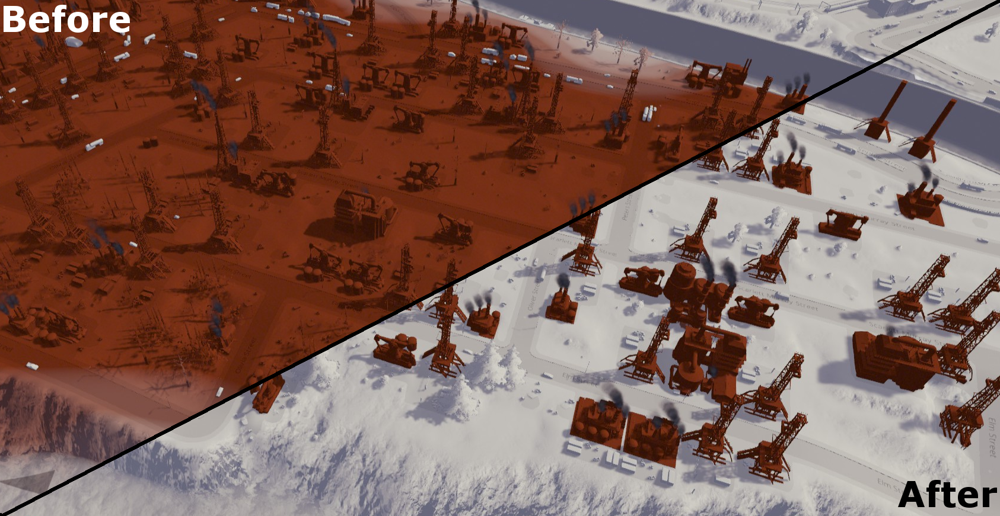
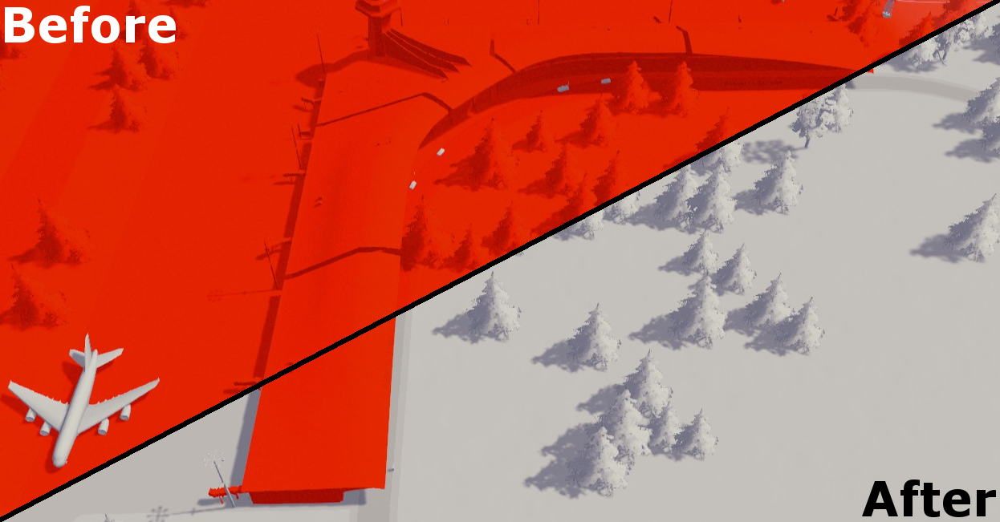

Pollution Solution - A Cities: Skylines Mod
===========================================

A simple mod for [Cities: Skylines](http://store.steampowered.com/app/255710/Cities_Skylines/) that allows you to enable/disable Noise, Ground, and Water pollution.  

Install
---
Subscribe to the mod on the Steam Workshop [here](http://steamcommunity.com/sharedfiles/filedetails/?id=1263262833).

Ground Pollution
---
- Disabling Ground Pollution takes effect after a few seconds.  
- Re-enabling Ground Pollution will take some time for the pollution to build up.

Noise Pollution
---
- Disabling and Re-enabling Noise Pollution takes effect after a few seconds.  

Water Pollution
---
- Disabling Water Pollution takes effect after a few seconds, but it will take some time for the water to clear up.
- Re-enabling Water Pollution takes effect after a few seconds, but it will take some time for the water to become polluted again.

Settings
---
- You can enable toggle each type of pollution individually.  
- Settings are live, so you can toggle them while a city is running.

Changelog
---
**1.0.1**
- Fixed noise pollution removal not working correctly when the game is run at higher than normal speeds (e.g. due to a mod)

**1.0.0**
- Initial release
