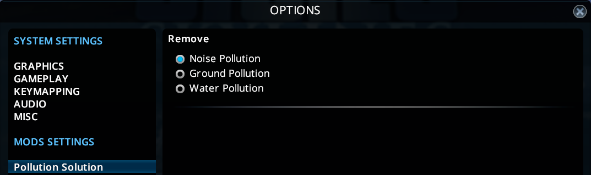

Pollution Solution - A Cities: Skylines Mod
===========================================

A simple mod for [Cities: Skylines](http://store.steampowered.com/app/255710/Cities_Skylines/) that allows you to enable/disable Noise, Ground, and Water pollution.  
See the settings panel to toggle each type of pollution individually.

You can find the mod on the Steam Workshop [here](http://steamcommunity.com/sharedfiles/filedetails/?id=1263262833).

Noise Pollution
---

Ground Pollution
---

Water Pollution
---

Settings
---

